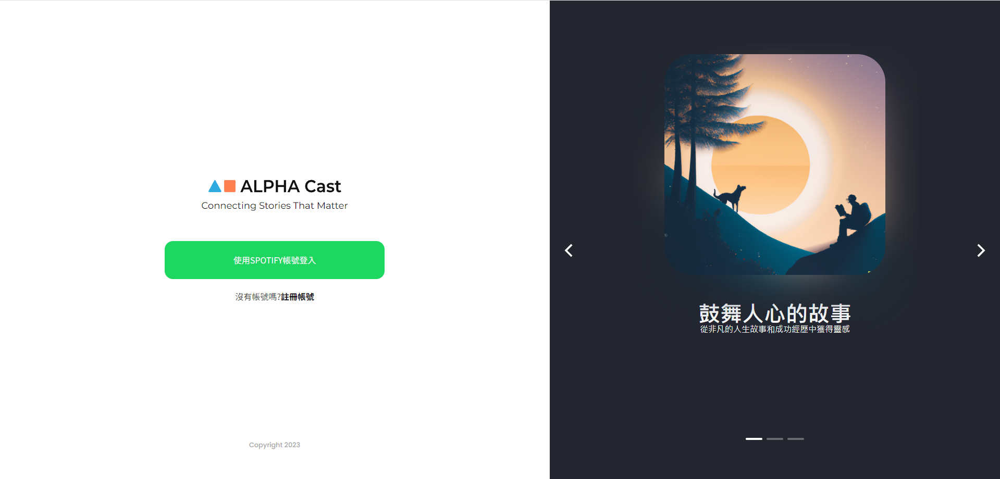
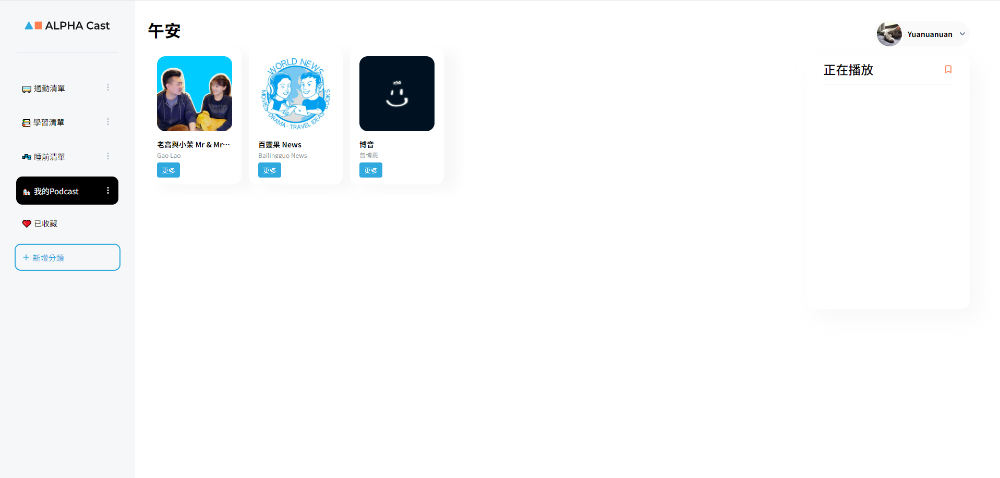
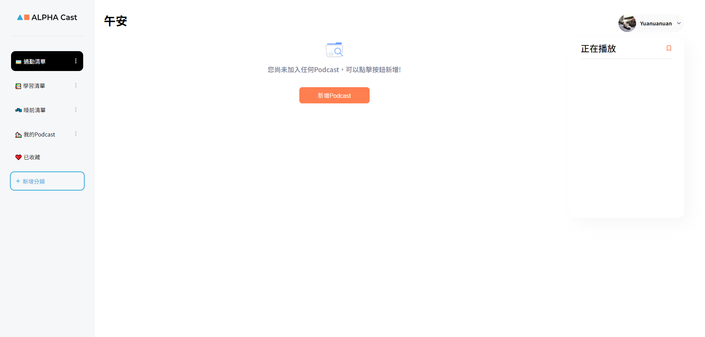
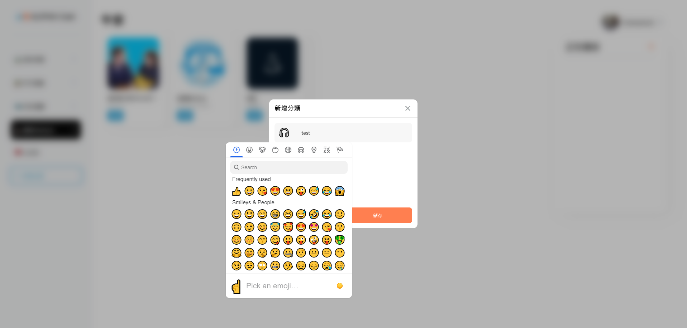
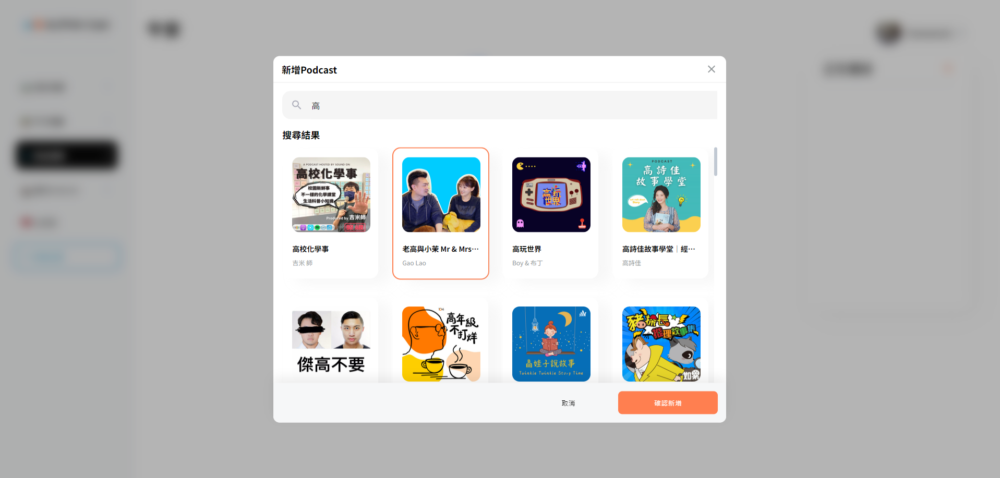
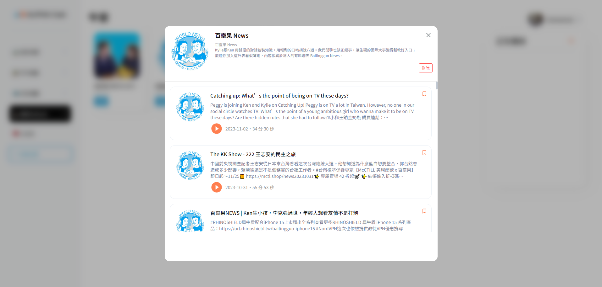
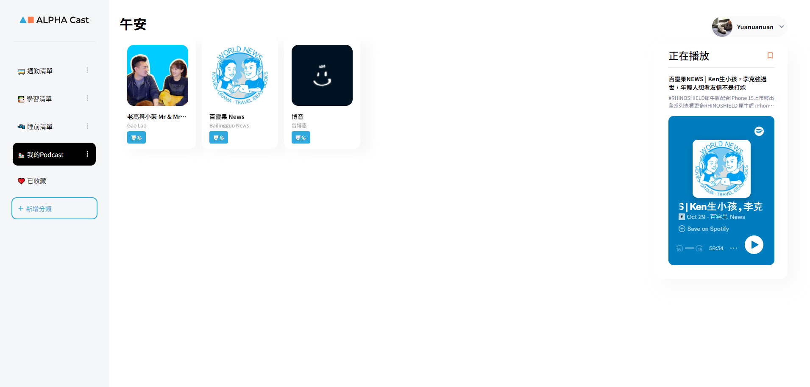

# ALPHA CAST

## 介紹

這是一個使用 Spotify 帳號登入的網站，並且可以瀏覽或收藏 Spotify 中的節目。
前端串接由 Spotify 提供的 API 來獲取資料。
後端使用由 APLHA CAMP 提供資料庫來儲存資料。

## 功能

- 瀏覽 Spotify 中的節目集、單集資訊、作者資訊等等。
- 創建分類來客製化自己喜愛的類別。
- 搜尋喜愛的節目集。
- 保存或移除喜愛的節目集。
- 收藏或移除喜愛的 Podcast。
- 播放收藏或保存的 Podcast。

## 開發工具

- react 18.2.0
- react-router-dom 6.16.0
- node-sass 7.0.3
- axios 1.5.1
- emoji-mart 5.5.2
- dotenv 16.3.1
- sweetalert2 11.9.0
